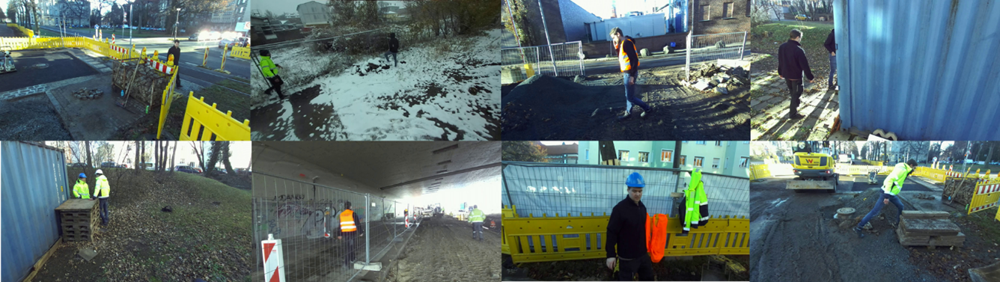

<table style="border-collapse: collapse; border: none;">
  <tr>
    <td style="border: none; padding: 0;">
      
    </td>
    <td style="border: none; padding: 0;">
      
    </td>
  </tr>
</table>

# Person Detection on Construction Sites
This repository presents a potentially safety critical, real-world object detection dataset of humans on various constructions sites.

Find the full dataset here:  
[https://zenodo.org/records/13987179](https://zenodo.org/records/13987179)

## License

This data set is published under the Creative Commons Attribution-ShareAlike 4.0 International (CC BY-SA 4.0) licence (https://creativecommons.org/licenses/by-sa/4.0/deed.en).

Dieser Datensatz wird unter der Creative Commons Attribution-ShareAlike 4.0 International (CC BY-SA 4.0) Lizenz veröffentlicht (https://creativecommons.org/licenses/by-sa/4.0/deed.de).

## Acknowledgements

The development of this data set was funded by the Federal Ministry of Labour and Social Affairs (BMAS) and the Federal Institute for Occupational Safety and Health (BAuA) under the administrative agreement ‘Artificial Intelligence in a Safe and Healthy Working Environment’.

Die Entwicklung dieses Datensatzes wurde durch das Bundesministerium für Arbeit und Soziales (BMAS) und die Bundesanstalt für Arbeitsschutz und Arbeitsmedizin (BAuA) unter der Verwaltungsvereinbarung "Künstliche Intelligenz in einer sicheren und gesunden Arbeitswelt" gefördert.
